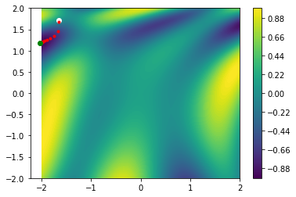

# 03-DESCENSO-DEL-GRADIENTE

```python
import numpy as np
import scipy as sc

import matplotlib.pyplot as plt
```


```python
func = lambda th: np.sin(1 / 2 * th[0] ** 2 - 1 / 4 * th[1] ** 2 + 3) * np.cos(2 * th[0] + 1 - np.e ** th[1])

res = 100

_X = np.linspace(-2, 2, res)
_Y = np.linspace(-2, 2, res)

_Z = np.zeros((res, res))

for ix, x in enumerate(_X):
    for iy, y in enumerate(_Y):
        _Z[iy, ix] = func([x, y])

plt.contourf(_X, _Y, _Z, 100)
plt.colorbar()

Theta = np.random.rand(2) * 4 - 2

_T = np.copy(Theta)
h = 0.001
lr = 0.01

plt.plot(Theta[0], Theta[1], "o", c="white")

grad = np.zeros(2)

for _ in range(1000):
    for it, th, in enumerate(Theta):
        _T = np.copy(Theta)
        _T[it]   = _T[it] + h
        deriv = (func(_T) - func(Theta)) / h
        grad[it] = deriv

    Theta = Theta - lr * grad
    print(func(Theta))
    
    if (_% 10 == 0):
        plt.plot(Theta[0], Theta[1], ".", c="red")


plt.plot(Theta[0], Theta[1], "o", c="green")


plt.show()
```

    -0.08804196516400907
    -0.16740060744845178
    -0.24232831023766294
    -0.31132093993734433
    -0.3735377960397289
    -0.4287763352197217
    -0.47733635781142747
    -0.5198392606274965
    -0.5570592050576854
    -0.5897962675189025
    -0.6187971478203825
    -0.6447152834718649
    -0.6680981033829139
    -0.6893903669626406
    -0.7089455474228074
    -0.7270401600861763
    -0.7438881566548958
    -0.7596539649044513
    -0.7744636218605305
    -0.7884139217729713
    -0.8015797315963681
    -0.8140197202107582
    -0.8257807677691962
    -0.8369013059424283
    -0.8474138092517113
    -0.8573466230512707
    -0.8667252803784424
    -0.8755734301426391
    -0.8839134737118323
    -0.8917669858402445
    -0.8991549786759895
    -0.906098053777772
    -0.9126164761224608
    -0.9187301955017216
    -0.9244588340434514
    -0.9298216534724462
    -0.9348375118259594
    -0.9395248164003983
    -0.9439014775124648
    -0.9479848660399293
    -0.9517917765290734
    -0.9553383968105065
    -0.9586402844706331
    -0.9617123501182947
    -0.9645688471164918
    -0.9672233672805829
    -0.969688841948867
    -0.971977547788061
    -0.9741011166891803
    -0.9760705491271102
    -0.9778962303910583
    -0.9795879491369786
    -0.9811549177622999
    -0.9826057941546936
    -0.983948704417911
    -0.9851912662273525
    -0.9863406125149615
    -0.987403415226695
    -0.9883859089358029
    -0.989293914131408
    -0.9901328600343288
    -0.9909078068209607
    -0.9916234671614015
    -0.9922842270001859
    -0.9928941655271971
    -0.993457074302809
    -0.9939764755153503
    -0.9944556393608209
    -0.9948976005446973
    -0.9953051739138071
    -0.9956809692329205
    -0.9960274051260319
    -0.9963467222064907
    -0.9966409954233436
    -0.9969121456536159
    -0.9971619505718925
    -0.9973920548296189
    -0.9976039795770645
    -0.9977991313610186
    -0.9979788104310688
    -0.9981442184868076
    -0.9982964658975967
    -0.9984365784256278
    -0.9985655034819891
    -0.9986841159443316
    -0.9987932235635397
    -0.9988935719855788
    -0.9989858494134414
    -0.9990706909328533
    -0.9991486825241503
    -0.9992203647815067
    -0.9992862363594859
    -0.9993467571657235
    -0.9994023513174126
    -0.99945340987818
    -0.9995002933908994
    -0.9995433342209893
    -0.9995828387238029
    -0.999619089248816
    -0.9996523459924671
    -0.9996828487107055
    -0.9997108183015433
    -0.9997364582671958
    -0.9997599560647242
    -0.9997814843534698
    -0.999801202146979
    -0.9998192558765674
    -0.9998357803731599
    -0.9998508997735596
    -0.9998647283568549
    -0.9998773713162533
    -0.9998889254712436
    -0.9998994799246248
    -0.9999091166686056
    -0.9999179111438651
    -0.9999259327551727
    -0.9999332453468994
    -0.9999399076414994
    -0.9999459736438102
    -0.9999514930138034
    -0.9999565114102218
    -0.9999610708073481
    -0.9999652097869858
    -0.9999689638075704
    -0.9999723654521836
    -0.9999754446571076
    -0.9999782289224316
    -0.9999807435061044
    -0.9999830116027256
    -0.999985054508258
    -0.9999868917717658
    -0.9999885413351849
    -0.9999900196620655
    -0.9999913418561438
    -0.9999925217705444
    -0.99999357210834
    -0.9999945045151506
    -0.9999953296644066
    -0.9999960573358465
    -0.9999966964877856
    -0.9999972553236417
    -0.999997741353172
    -0.9999981614488349
    -0.9999985218976617
    -0.9999988284489921
    -0.9999990863583992
    -0.9999993004281044
    -0.9999994750441605
    -0.9999996142106562
    -0.9999997215811793
    -0.9999998004877557
    -0.9999998539674612
    -0.9999998847868946
    -0.999999895464678
    -0.9999998882921431
    -0.9999998653523466
    -0.9999998285375478
    -0.9999997795652691
    -0.9999997199930575
    -0.9999996512320408
    -0.999999574559387
    -0.9999994911297422
    -0.9999994019857388
    -0.99999930806764
    -0.9999992102221976
    -0.9999991092107782
    -0.9999990057168227
    -0.99999890035269
    -0.999998793665934
    -0.9999986861450604
    -0.9999985782248053
    -0.9999984702909737
    -0.999998362684873
    -0.9999982557073755
    -0.99999814962264
    -0.9999980446615169
    -0.999997941024668
    -0.9999978388854194
    -0.9999977383923724
    -0.9999976396717885
    -0.9999975428297729
    -0.9999974479542666
    -0.9999973551168664
    -0.9999972643744872
    -0.9999971757708777
    -0.9999970893380024
    -0.9999970050973014
    -0.999996923060839
    -0.9999968432323477
    -0.999996765608178
    -0.9999966901781623
    -0.9999966169264006
    -0.9999965458319711
    -0.9999964768695759
    -0.9999964100101275
    -0.9999963452212758
    -0.9999962824678883
    -0.9999962217124814
    -0.9999961629156091
    -0.9999961060362157
    -0.9999960510319487
    -0.9999959978594433
    -0.9999959464745755
    -0.9999958968326883
    -0.9999958488887946
    -0.999995802597756
    -0.9999957579144432
    -0.9999957147938765
    -0.9999956731913502
    -0.9999956330625419
    -0.9999955943636081
    -0.9999955570512657
    -0.999995521082865
    -0.9999954864164504
    -0.9999954530108113
    -0.9999954208255274
    -0.9999953898210037
    -0.9999953599585001
    -0.9999953312001548
    -0.9999953035090018
    -0.9999952768489841
    -0.999995251184962
    -0.999995226482718
    -0.999995202708958
    -0.9999951798313096
    -0.9999951578183169
    -0.9999951366394348
    -0.9999951162650195
    -0.9999950966663171
    -0.9999950778154527
    -0.9999950596854151
    -0.9999950422500435
    -0.999995025484011
    -0.9999950093628077
    -0.9999949938627246
    -0.9999949789608343
    -0.9999949646349745
    -0.9999949508637281
    -0.9999949376264052
    -0.9999949249030243
    -0.9999949126742934
    -0.9999949009215906
    -0.9999948896269462
    -0.9999948787730228
    -0.9999948683430986
    -0.999994858321047
    -0.99999484869132
    -0.9999948394389298
    -0.9999948305494314
    -0.9999948220089054
    -0.9999948138039412
    -0.9999948059216203
    -0.9999947983495
    -0.9999947910755984
    -0.9999947840883778
    -0.9999947773767308
    -0.9999947709299646
    -0.9999947647377875
    -0.9999947587902949
    -0.9999947530779553
    -0.9999947475915977
    -0.9999947423223989
    -0.9999947372618704
    -0.9999947324018477
    -0.9999947277344772
    -0.999994723252206
    -0.9999947189477705
    -0.9999947148141863
    -0.9999947108447375
    -0.9999947070329668
    -0.9999947033726664
    -0.9999946998578685
    -0.9999946964828362
    -0.9999946932420553
    -0.9999946901302253
    -0.9999946871422525
    -0.9999946842732407
    -0.999994681518485
    -0.9999946788734643
    -0.9999946763338335
    -0.9999946738954181
    -0.9999946715542066
    -0.999994669306345
    -0.9999946671481301
    -0.9999946650760043
    -0.99999466308655
    -0.9999946611764838
    -0.9999946593426514
    -0.9999946575820228
    -0.9999946558916877
    -0.9999946542688503
    -0.9999946527108251
    -0.999994651215033
    -0.9999946497789965
    -0.9999946484003361
    -0.9999946470767666
    -0.9999946458060932
    -0.9999946445862079
    -0.9999946434150863
    -0.9999946422907843
    -0.999994641211435
    -0.9999946401752452
    -0.9999946391804934
    -0.9999946382255258
    -0.999994637308755
    -0.9999946364286562
    -0.9999946355837656
    -0.9999946347726771
    -0.9999946339940408
    -0.9999946332465607
    -0.9999946325289922
    -0.9999946318401401
    -0.9999946311788575
    -0.9999946305440418
    -0.9999946299346358
    -0.9999946293496237
    -0.9999946287880301
    -0.999994628248919
    -0.9999946277313915
    -0.9999946272345842
    -0.9999946267576685
    -0.9999946262998488
    -0.9999946258603616
    -0.9999946254384731
    -0.9999946250334795
    -0.9999946246447048
    -0.9999946242715
    -0.999994623913242
    -0.9999946235693327
    -0.9999946232391981
    -0.9999946229222865
    -0.9999946226180688
    -0.999994622326037
    -0.9999946220457032
    -0.999994621776599
    -0.9999946215182751
    -0.9999946212702997
    -0.9999946210322586
    -0.9999946208037538
    -0.9999946205844036
    -0.9999946203738415
    -0.9999946201717154
    -0.9999946199776875
    -0.9999946197914337
    -0.9999946196126422
    -0.9999946194410148
    -0.9999946192762639
    -0.9999946191181144
    -0.999994618966302
    -0.9999946188205726
    -0.9999946186806826
    -0.999994618546398
    -0.9999946184174946
    -0.9999946182937565
    -0.9999946181749768
    -0.999994618060957
    -0.9999946179515065
    -0.999994617846442
    -0.9999946177455876
    -0.9999946176487752
    -0.9999946175558424
    -0.9999946174666339
    -0.9999946173810004
    -0.9999946172987988
    -0.9999946172198915
    -0.9999946171441465
    -0.9999946170714372
    -0.9999946170016417
    -0.9999946169346435
    -0.9999946168703304
    -0.9999946168085949
    -0.9999946167493335
    -0.9999946166924473
    -0.9999946166378408
    -0.9999946165854231
    -0.9999946165351061
    -0.9999946164868059
    -0.9999946164404413
    -0.9999946163959351
    -0.9999946163532126
    -0.9999946163122024
    -0.999994616272836
    -0.9999946162350474
    -0.9999946161987733
    -0.9999946161639529
    -0.9999946161305283
    -0.9999946160984434
    -0.9999946160676444
    -0.9999946160380798
    -0.9999946160097004
    -0.9999946159824583
    -0.999994615956308
    -0.999994615931206
    -0.9999946159071099
    -0.9999946158839799
    -0.9999946158617768
    -0.9999946158404637
    -0.9999946158200047
    -0.9999946158003659
    -0.999994615781514
    -0.9999946157634182
    -0.9999946157460474
    -0.9999946157293729
    -0.9999946157133667
    -0.9999946156980021
    -0.9999946156832532
    -0.9999946156690956
    -0.9999946156555055
    -0.9999946156424601
    -0.9999946156299376
    -0.9999946156179171
    -0.9999946156063783
    -0.999994615595302
    -0.9999946155846696
    -0.9999946155744636
    -0.9999946155646664
    -0.999994615555262
    -0.9999946155462347
    -0.9999946155375691
    -0.9999946155292508
    -0.999994615521266
    -0.9999946155136014
    -0.9999946155062438
    -0.9999946154991811
    -0.9999946154924017
    -0.9999946154858937
    -0.9999946154796469
    -0.9999946154736503
    -0.9999946154678941
    -0.9999946154623687
    -0.9999946154570646
    -0.9999946154519732
    -0.9999946154470859
    -0.9999946154423945
    -0.9999946154378911
    -0.9999946154335682
    -0.9999946154294186
    -0.9999946154254354
    -0.9999946154216118
    -0.9999946154179414
    -0.9999946154144183
    -0.9999946154110363
    -0.9999946154077898
    -0.9999946154046735
    -0.9999946154016821
    -0.9999946153988106
    -0.9999946153960543
    -0.9999946153934084
    -0.9999946153908685
    -0.9999946153884305
    -0.9999946153860901
    -0.9999946153838437
    -0.9999946153816872
    -0.9999946153796172
    -0.99999461537763
    -0.9999946153757227
    -0.9999946153738917
    -0.9999946153721342
    -0.9999946153704469
    -0.9999946153688275
    -0.9999946153672729
    -0.9999946153657807
    -0.9999946153643481
    -0.9999946153629732
    -0.9999946153616532
    -0.9999946153603861
    -0.99999461535917
    -0.9999946153580025
    -0.9999946153568818
    -0.999994615355806
    -0.9999946153547735
    -0.9999946153537822
    -0.9999946153528307
    -0.9999946153519174
    -0.9999946153510406
    -0.999994615350199
    -0.999994615349391
    -0.9999946153486156
    -0.9999946153478712
    -0.9999946153471565
    -0.9999946153464706
    -0.9999946153458122
    -0.9999946153451802
    -0.9999946153445735
    -0.999994615343991
    -0.9999946153434319
    -0.9999946153428954
    -0.9999946153423802
    -0.9999946153418857
    -0.9999946153414111
    -0.9999946153409556
    -0.9999946153405181
    -0.9999946153400981
    -0.9999946153396952
    -0.9999946153393083
    -0.9999946153389371
    -0.9999946153385806
    -0.9999946153382383
    -0.9999946153379098
    -0.9999946153375946
    -0.999994615337292
    -0.9999946153370014
    -0.9999946153367225
    -0.9999946153364548
    -0.9999946153361978
    -0.9999946153359512
    -0.9999946153357144
    -0.9999946153354871
    -0.9999946153352689
    -0.9999946153350594
    -0.9999946153348584
    -0.9999946153346654
    -0.9999946153344802
    -0.9999946153343025
    -0.9999946153341317
    -0.9999946153339678
    -0.9999946153338106
    -0.9999946153336595
    -0.9999946153335146
    -0.9999946153333755
    -0.999994615333242
    -0.9999946153331137
    -0.9999946153329907
    -0.9999946153328726
    -0.9999946153327591
    -0.9999946153326503
    -0.9999946153325459
    -0.9999946153324456
    -0.9999946153323492
    -0.999994615332257
    -0.9999946153321682
    -0.999994615332083
    -0.9999946153320013
    -0.9999946153319228
    -0.9999946153318475
    -0.9999946153317752
    -0.9999946153317059
    -0.9999946153316391
    -0.9999946153315752
    -0.9999946153315139
    -0.999994615331455
    -0.9999946153313984
    -0.9999946153313441
    -0.9999946153312921
    -0.9999946153312419
    -0.9999946153311938
    -0.9999946153311479
    -0.9999946153311036
    -0.999994615331061
    -0.9999946153310203
    -0.9999946153309811
    -0.9999946153309436
    -0.9999946153309076
    -0.9999946153308729
    -0.9999946153308397
    -0.9999946153308078
    -0.9999946153307772
    -0.9999946153307478
    -0.9999946153307195
    -0.9999946153306924
    -0.9999946153306665
    -0.9999946153306416
    -0.9999946153306176
    -0.9999946153305945
    -0.9999946153305725
    -0.9999946153305513
    -0.999994615330531
    -0.9999946153305116
    -0.9999946153304927
    -0.9999946153304748
    -0.9999946153304575
    -0.999994615330441
    -0.999994615330425
    -0.9999946153304097
    -0.999994615330395
    -0.9999946153303809
    -0.9999946153303675
    -0.9999946153303545
    -0.9999946153303421
    -0.9999946153303301
    -0.9999946153303186
    -0.9999946153303075
    -0.9999946153302971
    -0.9999946153302869
    -0.9999946153302771
    -0.9999946153302678
    -0.9999946153302589
    -0.9999946153302501
    -0.9999946153302419
    -0.999994615330234
    -0.9999946153302265
    -0.999994615330219
    -0.999994615330212
    -0.9999946153302053
    -0.9999946153301988
    -0.9999946153301927
    -0.9999946153301867
    -0.999994615330181
    -0.9999946153301754
    -0.9999946153301702
    -0.9999946153301651
    -0.9999946153301602
    -0.9999946153301555
    -0.9999946153301512
    -0.9999946153301469
    -0.9999946153301427
    -0.9999946153301388
    -0.999994615330135
    -0.9999946153301312
    -0.9999946153301278
    -0.9999946153301245
    -0.9999946153301212
    -0.9999946153301181
    -0.9999946153301151
    -0.9999946153301122
    -0.9999946153301096
    -0.9999946153301069
    -0.9999946153301044
    -0.999994615330102
    -0.9999946153300997
    -0.9999946153300974
    -0.9999946153300953
    -0.9999946153300932
    -0.9999946153300912
    -0.9999946153300894
    -0.9999946153300875
    -0.9999946153300858
    -0.9999946153300842
    -0.9999946153300825
    -0.9999946153300809
    -0.9999946153300795
    -0.999994615330078
    -0.9999946153300766
    -0.9999946153300753
    -0.999994615330074
    -0.999994615330073
    -0.9999946153300717
    -0.9999946153300706
    -0.9999946153300696
    -0.9999946153300685
    -0.9999946153300675
    -0.9999946153300666
    -0.9999946153300656
    -0.9999946153300648
    -0.999994615330064
    -0.9999946153300632
    -0.9999946153300624
    -0.9999946153300617
    -0.999994615330061
    -0.9999946153300603
    -0.9999946153300595
    -0.999994615330059
    -0.9999946153300584
    -0.9999946153300577
    -0.9999946153300573
    -0.9999946153300567
    -0.9999946153300562
    -0.9999946153300557
    -0.9999946153300553
    -0.9999946153300547
    -0.9999946153300543
    -0.999994615330054
    -0.9999946153300535
    -0.9999946153300531
    -0.9999946153300527
    -0.9999946153300524
    -0.9999946153300521
    -0.9999946153300519
    -0.9999946153300514
    -0.9999946153300511
    -0.9999946153300509
    -0.9999946153300506
    -0.9999946153300503
    -0.99999461533005
    -0.9999946153300497
    -0.9999946153300495
    -0.9999946153300493
    -0.9999946153300492
    -0.999994615330049
    -0.9999946153300487
    -0.9999946153300486
    -0.9999946153300483
    -0.9999946153300482
    -0.999994615330048
    -0.9999946153300479
    -0.9999946153300476
    -0.9999946153300475
    -0.9999946153300474
    -0.9999946153300473
    -0.9999946153300472
    -0.999994615330047
    -0.9999946153300467
    -0.9999946153300467
    -0.9999946153300466
    -0.9999946153300465
    -0.9999946153300464
    -0.9999946153300463
    -0.9999946153300462
    -0.9999946153300461
    -0.9999946153300461
    -0.999994615330046
    -0.9999946153300459
    -0.9999946153300459
    -0.9999946153300457
    -0.9999946153300456
    -0.9999946153300456
    -0.9999946153300455
    -0.9999946153300455
    -0.9999946153300454
    -0.9999946153300454
    -0.9999946153300453
    -0.9999946153300453
    -0.9999946153300451
    -0.9999946153300451
    -0.9999946153300451
    -0.999994615330045
    -0.999994615330045
    -0.999994615330045
    -0.9999946153300449
    -0.9999946153300449
    -0.9999946153300449
    -0.9999946153300447
    -0.9999946153300447
    -0.9999946153300447
    -0.9999946153300446
    -0.9999946153300446
    -0.9999946153300446
    -0.9999946153300446
    -0.9999946153300445
    -0.9999946153300445
    -0.9999946153300445
    -0.9999946153300445
    -0.9999946153300445
    -0.9999946153300445
    -0.9999946153300445
    -0.9999946153300444
    -0.9999946153300444
    -0.9999946153300444
    -0.9999946153300444
    -0.9999946153300444
    -0.9999946153300443
    -0.9999946153300443
    -0.9999946153300443
    -0.9999946153300443
    -0.9999946153300443
    -0.9999946153300443
    -0.9999946153300442
    -0.9999946153300442
    -0.9999946153300442
    -0.9999946153300442
    -0.9999946153300442
    -0.9999946153300442
    -0.9999946153300442
    -0.9999946153300442
    -0.9999946153300442
    -0.9999946153300442
    -0.9999946153300442
    -0.9999946153300442
    -0.9999946153300442
    -0.9999946153300442
    -0.9999946153300441
    -0.9999946153300441
    -0.9999946153300441
    -0.9999946153300441
    -0.9999946153300441
    -0.9999946153300441
    -0.9999946153300441
    -0.9999946153300441
    -0.9999946153300441
    -0.9999946153300441
    -0.9999946153300441
    -0.9999946153300441
    -0.9999946153300441
    -0.9999946153300441
    -0.9999946153300441
    -0.9999946153300441
    -0.9999946153300441
    -0.9999946153300441
    -0.9999946153300441
    -0.9999946153300441
    -0.9999946153300441
    -0.9999946153300441
    -0.9999946153300441
    -0.9999946153300441
    -0.9999946153300441
    -0.9999946153300441
    -0.9999946153300441
    -0.9999946153300441
    -0.9999946153300441
    -0.9999946153300441
    -0.9999946153300441
    -0.9999946153300441
    -0.9999946153300441
    -0.9999946153300441
    -0.9999946153300441
    -0.9999946153300441
    -0.9999946153300441
    -0.9999946153300441
    -0.9999946153300441
    -0.9999946153300441
    -0.9999946153300441
    -0.9999946153300441
    -0.9999946153300441
    -0.9999946153300441
    -0.9999946153300441
    -0.9999946153300441
    -0.9999946153300441
    -0.9999946153300441
    -0.9999946153300441
    -0.9999946153300441
    -0.9999946153300441
    -0.9999946153300441
    -0.9999946153300441
    -0.9999946153300441
    -0.9999946153300441
    -0.9999946153300441
    -0.9999946153300441
    -0.9999946153300441
    -0.9999946153300441
    -0.9999946153300441
    -0.9999946153300441
    -0.9999946153300441
    -0.9999946153300441
    -0.9999946153300441
    -0.9999946153300441
    -0.9999946153300441
    -0.9999946153300441
    -0.9999946153300441
    -0.9999946153300441
    -0.9999946153300441
    -0.9999946153300441
    -0.9999946153300441
    -0.9999946153300441
    -0.9999946153300441
    -0.9999946153300441
    -0.9999946153300441
    -0.9999946153300441
    -0.9999946153300441
    -0.9999946153300441
    -0.9999946153300441
    -0.9999946153300441
    -0.9999946153300441
    -0.9999946153300441
    -0.9999946153300441
    -0.9999946153300441
    -0.9999946153300441
    -0.9999946153300441
    -0.9999946153300441
    -0.9999946153300441
    -0.9999946153300441
    -0.9999946153300441
    -0.9999946153300441
    -0.9999946153300441
    -0.9999946153300441
    -0.9999946153300441
    -0.9999946153300441
    -0.9999946153300441
    -0.9999946153300441
    -0.9999946153300441
    -0.9999946153300441
    -0.9999946153300441
    -0.9999946153300441
    -0.9999946153300441
    -0.9999946153300441
    -0.9999946153300441
    -0.9999946153300441
    -0.9999946153300441
    -0.9999946153300441
    -0.9999946153300441
    -0.9999946153300441
    -0.9999946153300441
    -0.9999946153300441
    -0.9999946153300441
    -0.9999946153300441
    -0.9999946153300441
    -0.9999946153300441
    -0.9999946153300441
    -0.9999946153300441
    -0.9999946153300441
    -0.9999946153300441
    -0.9999946153300441
    -0.9999946153300441
    -0.9999946153300441
    -0.9999946153300441
    -0.9999946153300441
    -0.9999946153300441
    -0.9999946153300441
    -0.9999946153300441
    -0.9999946153300441
    -0.9999946153300441
    -0.9999946153300441
    -0.9999946153300441
    -0.9999946153300441
    -0.9999946153300441
    -0.9999946153300441
    -0.9999946153300441
    -0.9999946153300441
    -0.9999946153300441
    -0.9999946153300441
    -0.9999946153300441
    -0.9999946153300441
    -0.9999946153300441
    -0.9999946153300441
    -0.9999946153300441
    -0.9999946153300441
    -0.9999946153300441
    -0.9999946153300441
    -0.9999946153300441
    -0.9999946153300441
    -0.9999946153300441
    -0.9999946153300441
    -0.9999946153300441
    -0.9999946153300441
    -0.9999946153300441
    -0.9999946153300441
    -0.9999946153300441
    -0.9999946153300441
    -0.9999946153300441
    -0.9999946153300441
    -0.9999946153300441
    -0.9999946153300441
    -0.9999946153300441
    -0.9999946153300441
    -0.9999946153300441
    -0.9999946153300441
    -0.9999946153300441
    -0.9999946153300441
    -0.9999946153300441
    -0.9999946153300441
    -0.9999946153300441
    -0.9999946153300441
    -0.9999946153300441
    -0.9999946153300441
    -0.9999946153300441
    -0.9999946153300441
    -0.9999946153300441
    -0.9999946153300441
    -0.9999946153300441
    -0.9999946153300441
    -0.9999946153300441
    -0.9999946153300441
    -0.9999946153300441
    -0.9999946153300441
    -0.9999946153300441
    -0.9999946153300441
    -0.9999946153300441
    -0.9999946153300441
    -0.9999946153300441
    -0.9999946153300441
    -0.9999946153300441
    -0.9999946153300441
    -0.9999946153300441
    -0.9999946153300441
    -0.9999946153300441
    -0.9999946153300441
    -0.9999946153300441
    -0.9999946153300441
    -0.9999946153300441
    -0.9999946153300441
    -0.9999946153300441
    -0.9999946153300441
    -0.9999946153300441
    -0.9999946153300441
    -0.9999946153300441
    -0.9999946153300441
    -0.9999946153300441
    -0.9999946153300441
    -0.9999946153300441
    -0.9999946153300441
    -0.9999946153300441
    -0.9999946153300441
    -0.9999946153300441
    -0.9999946153300441
    -0.9999946153300441
    -0.9999946153300441
    -0.9999946153300441
    -0.9999946153300441
    -0.9999946153300441
    -0.9999946153300441
    -0.9999946153300441
    -0.9999946153300441
    -0.9999946153300441
    -0.9999946153300441
    -0.9999946153300441
    -0.9999946153300441
    -0.9999946153300441
    -0.9999946153300441
    -0.9999946153300441
    -0.9999946153300441
    -0.9999946153300441
    -0.9999946153300441
    -0.9999946153300441
    -0.9999946153300441
    -0.9999946153300441
    -0.9999946153300441
    -0.9999946153300441
    -0.9999946153300441
    -0.9999946153300441
    -0.9999946153300441
    -0.9999946153300441





```python

```


```python

```


```python

```
